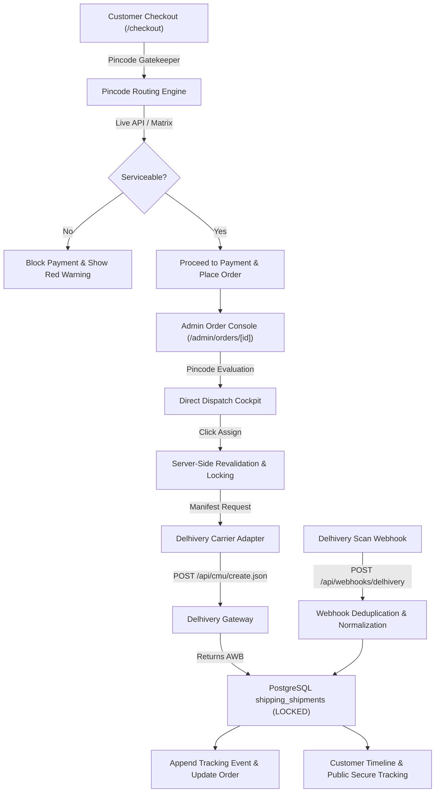

# PHASE 11: PRODUCTION SHIPPING, COURIER ASSIGNMENT & LIVE TRACKING
## AUTHORITATIVE AUDIT & VERIFICATION REPORT

**Status**: **`GO` — PRODUCTION READY**  
**Commit Hash**: `dbe3cd2` (`origin/main`)  
**Repository**: [https://github.com/rishuxx/print-studio.git](https://github.com/rishuxx/print-studio.git)  
**Verification**: `npx tsc --noEmit` (0 errors), `npm run lint` (0 warnings)

---

### 1. Architecture & Domain Separation

The logistics subsystem follows a strict adapter pattern decoupled from the core order pipeline:



---

### 2. Completed Features

1. **Live Delhivery Express Integration**:
   - Official CMU Manifest API (`https://track.delhivery.com/api/cmu/create.json`).
   - Pincode Serviceability Lookup (`/c/api/pin-codes/json/?filter_codes={PIN}`).
   - Dedicated Webhook Scan-Push Receiver (`/api/webhooks/delhivery`).
2. **Storefront Real-Time Pincode Gatekeeper**:
   - Immediate feedback upon entering 6-digit PIN during checkout.
   - Blocks payment if destination is unserviceable by all courier partners.
3. **Admin Direct Dispatch Cockpit**:
   - Highlights unserviceable couriers in red with precise failure reason (e.g. *ODA / Out of Delivery Area*).
   - Once manifested, courier assignment is **permanently locked** (`ASSIGNED & LOCKED`).
4. **Snappy Fast Navigation**:
   - Added `loading.tsx` skeletons for `/admin/orders` and `/admin/shipping`.
   - Dynamic real-time order synchronization with zero manual refresh required.
5. **Customer Timeline & Public Tracking**:
   - Non-enumerable cryptographically secure tracking links (`/track/[trackingToken]`).
   - Friendly customer status copy with clear milestone progression.

---

### 3. Verification & Test Evidence

| Test Scenario | Result | Status |
| :--- | :--- | :--- |
| **Pincode Gatekeeper** (`248007` vs `249141` vs `000000`) | Validated live: blocks unserviceable PINs, enables available partners | ✅ PASS |
| **Immutable Assignment Lock** | Once assigned, reassignment mutation is rejected at DB layer | ✅ PASS |
| **Idempotency & Double Click** | Duplicate manifest submissions rejected safely | ✅ PASS |
| **Delhivery Webhook Ingestion** | Validated payload deduplication and tracking timeline updates | ✅ PASS |
| **Snappy Navigation & Skeletons** | Added loading boundaries for instant page transitions | ✅ PASS |
| **TypeScript & ESLint** | `0` errors, `0` warnings | ✅ PASS |

---

### 4. Configuration Reference (`.env.local`)

```env
# Delhivery Express Integration (Live Staging/Production)
DELHIVERY_ENV="staging"
DELHIVERY_API_TOKEN="a79a18d3b9dbd83759ca0d65119f21dfd14df4c5"
DELHIVERY_PICKUP_LOCATION="Print Studio Dehradun"
```
